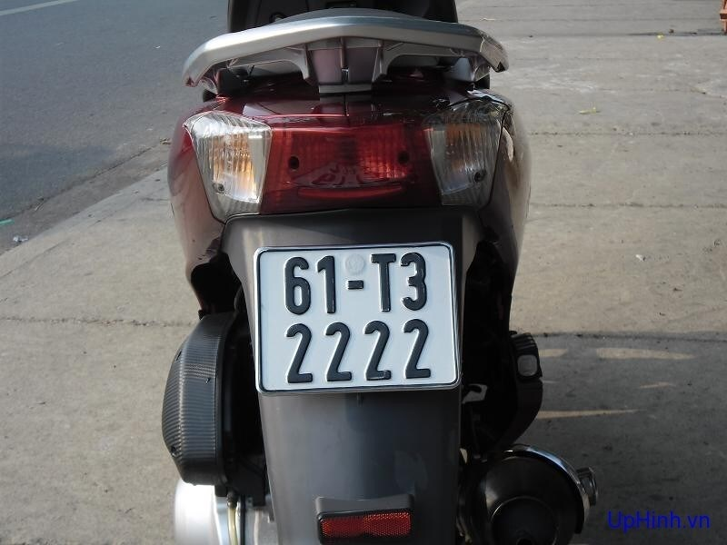
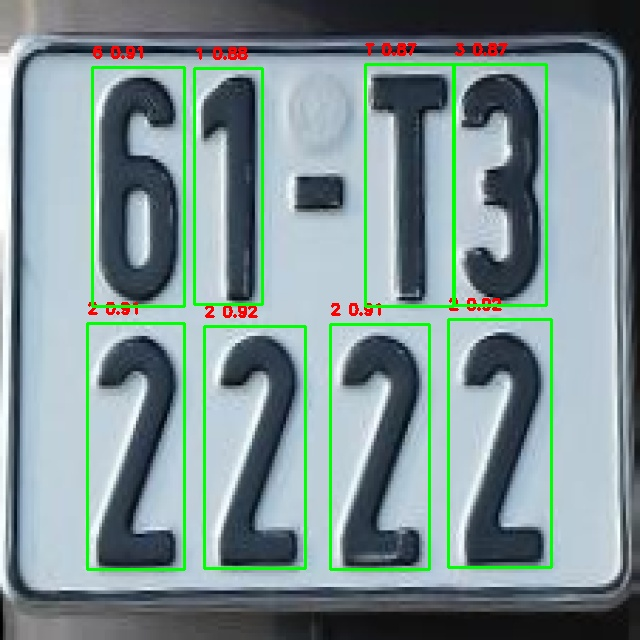

# do thời gian có hạn nên em chưa tìm được cách xóa file Word và PowerPoint cũ, Mong cô giáo thông cảm
# Môn học: Xử lý ảnh và thị giác máy tính  
#Giảng viên hướng dẫn: Lương Thị Hồng Lan 
#Nhóm 05: Mai Thanh Bình | Lường Văn Chung | Đoàn Văn Sơn | Nguyễn Trọng Tấn | Đỗ Quốc Trung  
#Đề tài nhận diện biển số xe tự động với OpenCV 
#Triển khai:
-Thu thập dữ liệu của biển số và ký tự
-Train 2 model Yolov8 bằng GPU của Google Colab 
-Sau khi train xong, dùng 2 file best.pt để thực hiện xử lý code phát hiện biển số và nhận diện ký tự trong biển số. 

# Kết quả đạt được
--Độ chính xác tren 90% đối với 2 model
# Dataset 
- do data quá lớn vui lòng truy cập: https://drive.google.com/file/d/1DgQJY9cMwjaSYzHth1XAmcYGUe87TyvB/view?usp=sharing để tải
# Kết quả thực nghiệm

--Kết quả tốt :))--
